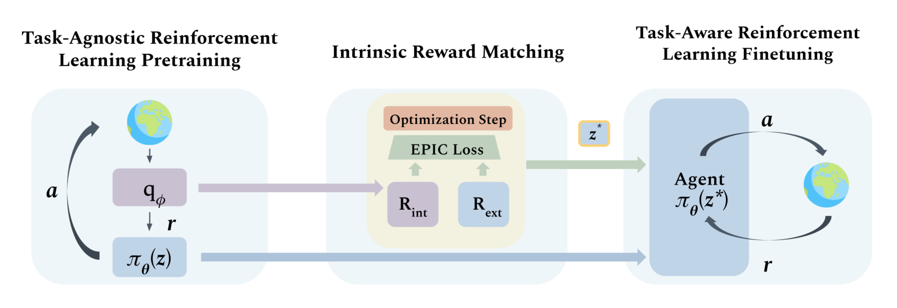

# IRM



This codebase is built on top of the [Contrastive Intrinsic Control (CIC) codebase](https://github.com/rll-research/cic). 

To pre-train an agent `dads` or `cic`, run the following command:

```sh
python pretrain.py agent=AGENT domain=DOMAIN experiment_folder=YOUR_EXP_FOLDER experiment_name=YOUR_EXP_NAME 
```

To finetune CIC, run the following command. Make sure to specify the directory of your saved snapshots with `YOUR_EXP_NAME`.

```sh
python finetune.py agent=AGENT experiment=YOUR_EXP_NAME task=TASK extr_reward=REWARD restore_snapshot_ts=2000000 restore_snapshot_dir=PATH_TO_PRETRAINED_MODEL
```

In addition, we include a visualization script. You can use this script to see detailed insights into the IRM skill selection process. 

```sh
python visualize_irm.py agent=AGENT experiment=YOUR_EXP_NAME domain=DOMAIN restore_snapshot_ts=2000000 restore_snapshot_dir=PATH_TO_PRETRAINED_MODEL
```
<!--  -->


For sequential task finetuning (or IRM visualizations), add the flags `extr_reward_seq=[REW1,REW2,REW3]` and `extr_reward=REW1`.

## Requirements 
We assume you have access to a GPU that can run CUDA 10.2 and CUDNN 8. Then, the simplest way to install all required dependencies is to create an anaconda environment by running
```sh
conda env create -f conda_env.yml
```
After the instalation ends you can activate your environment with
```sh
conda activate irm
```
todo: install gym

## Available Domains
We work on the following domains + tasks:
| Domain | Tasks | Reduced State |
|---|---|---|
| `fetch_reach` | `goal_0.5_0.5_0.5`, `goal_1_1.2_1`  | `fetch_reach_xyz` |
| `fetch_push` | `goal_barrier1`, `goal_barrier2`, `goal_barrier3` | `fetch_push_xy` |
| `fetch_barrier` | `goal_barrier1`, `goal_barrier2`, `goal_barrier3` | `fetch_push_xy` |
| `walker` | `stand`, `walk`, `run`, `flip` | `quadruped_velocity` |
| `quadruped` | `walk`, `run`, `stand`, `jump` | `walker_delta_xyz` |
| `jaco` | `reach_top_left`, `reach_top_right`, `reach_bottom_left`, `reach_bottom_right` | `jaco_xyz` |
| `plane` | `goal_top_right`, `goal_top_left` | `states`


### Monitoring
Logs are stored in the `exp_local` folder. To launch tensorboard run:
```sh
tensorboard --logdir exp_local
```

You may also enable logging to wandb and view logs there.

### todos
- formatting (at end)
- fix conda env
